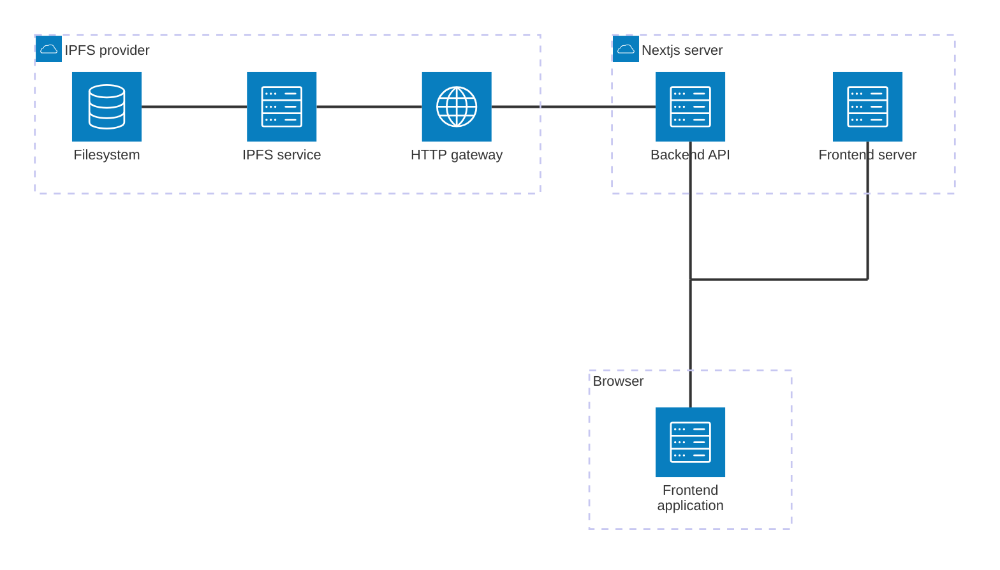
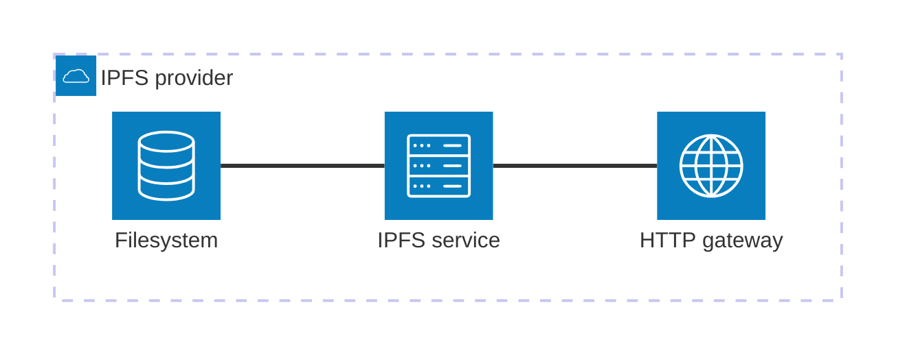

# NFT Forge Architecture

This project utilizes [Next.js](https://nextjs.org/), a full-stack React framework. We chose Next.js because the project requires only a few simple backend endpoints, which can be deployed on the same server as the frontend application. Additionally, Next.js simplifies frontend development and deployment.

## Components

This repository contains a single Next.js project that handles both the frontend and backend. The main components are:

1. **Next.js server**, which includes:
   1. **Backend API** - communicates with the IPFS server and the frontend application
   2. **Frontend Application Server** - delivers data to the frontend application
2. **Frontend application** running in the browser - communicates with the Next.js server
3. **IPFS service provider** - interacts with the backend API. This is not part of this project and must be set up separately. More details can be found in the [IPFS system design](#ipfs-system-design) section

### Components visualization



## Backend API

The Backend API provides the following REST endpoints under the `/api` route:

### `/ipfs/upload`

#### Arguments

Form data with a `file` entry containing the file to be uploaded. Only image files are supported.

#### Returned data

A JSON object with the following fields:

- `name`: name of the uploaded file
- `size`: size of the uploaded file
- `cid`: identifier (Content ID) of the uploaded file

**Example response:**

```json
{
  "name": "image.png",
  "size": 87552,
  "cid": "QmYWkhfnAyZohSV7Nut5cE8nko2RR5X9HD89hBxVqVdtNb"
}
```

#### Errors

- **400:** `Invalid form data` - form data is missing or invalid
- **400:** `File not provided` - form data is present, but the `file` entry is missing
- **400:** `Invalid file` - provided content is not a valid file
- **400:** `Invalid file type (only images are supported)` - provided file is not an image
- **500:** `Failed to upload file` - upload failed due to an unexpected server error

### `/ipfs/pins`

#### Arguments

_No arguments._

#### Returned data

An array of IDs representing all pinned files in the IPFS storage.

**Example Response:**

```json
[
  "QmS5cKMjR3kXaTWoJvghPar8sT68kUfChE2dD8JG1QBqN1",
  "QmW3Tpo1i5VPX33o3ShahjDm69VTDdVkJpRACy6orUAfgY",
  "QmYWkhfnAyZohSV7Nut5cE8nko2RR5X9HD89hBxVqVdtNb"
]
```

#### Errors

_No errors._

## IPFS System Design

The InterPlanetary File System (IPFS) is used as a database system for storing NFT images. The infrastructure for the IPFS service is not included in this project and must be set up separately. The components of the WingRiders IPFS service are as follows:

1. **Core IPFS service** - orchestrates the IPFS functionality
2. **HTTP gateway** - serves as a bridge between the IPFS service and other systems, such as the Next.js backend API
3. **Filesystem** - provides storage for IPFS files. It is mounted across all availability zones (AZs), and uploaded files are automatically pinned. The filesystem is backed up and has a sufficiently long retention policy


