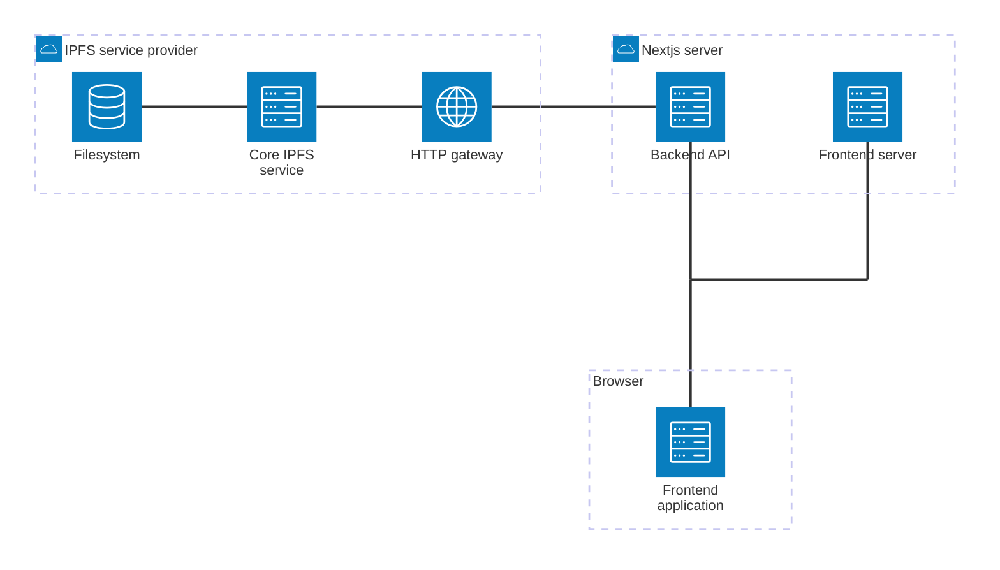
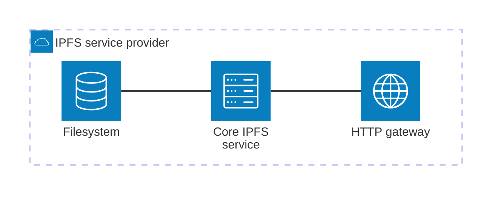

# NFT Forge Architecture

This project utilizes [Next.js](https://nextjs.org/), a full-stack React framework. We chose Next.js because the project requires only a few backend endpoints, which can be deployed on the same server as the frontend application. Additionally, Next.js simplifies frontend development and deployment. The whole Next.js project is written in TypeScript.

## Components

This repository contains a Next.js project that handles both the frontend and backend. The main components are:

1. **Next.js server**, which includes:
   1. **Backend API** - communicates with the IPFS server and the frontend application
   2. **Frontend Application Server** - delivers data to the frontend application
2. **Frontend application** running in the browser - communicates with the Next.js server
3. **IPFS service provider** - interacts with the backend API. This is not part of this project and must be set up separately. More details can be found in the [IPFS system design](#ipfs-system-design) section

### Components visualization



## Backend API

The backend API is part of the Next.js server and it's written in TypeScript. It provides the following REST endpoints under the `/api` route:

### `/ipfs/upload`

#### Arguments

Form data with a `file` entry containing the file to be uploaded. Only image files are supported. A file is considered an image if its MIME type begins with `image`. The MIME type is detected by checking the file's _magic number_.

#### Returned data

A JSON object with the following fields:

- `name`: name of the uploaded file
- `size`: size of the uploaded file
- `cid`: identifier (Content ID) of the uploaded file

**Example response:**

```json
{
  "name": "image.png",
  "size": 87552,
  "cid": "QmYWkhfnAyZohSV7Nut5cE8nko2RR5X9HD89hBxVqVdtNb"
}
```

#### Errors

- **400:** `Invalid form data` - form data is missing or invalid
- **400:** `File not provided` - form data is present, but the `file` entry is missing
- **400:** `Invalid file` - provided content is not a valid file
- **400:** `Invalid file type (only images are supported)` - provided file is not an image
- **500:** `Failed to upload file` - upload failed due to an unexpected server error

### `/ipfs/pins`

#### Arguments

_No arguments._

#### Returned data

An array of IDs representing all pinned files in the IPFS storage.

**Example Response:**

```json
[
  "QmS5cKMjR3kXaTWoJvghPar8sT68kUfChE2dD8JG1QBqN1",
  "QmW3Tpo1i5VPX33o3ShahjDm69VTDdVkJpRACy6orUAfgY",
  "QmYWkhfnAyZohSV7Nut5cE8nko2RR5X9HD89hBxVqVdtNb"
]
```

#### Errors

_No errors._

### Scalability

The scalability of the backend API largely depends on the configuration of your infrastructure. To handle increased traffic, you can deploy multiple instances of the Next.js server, such as through Docker containers. Implementing a load balancer is essential to distribute incoming traffic evenly across these instances, ensuring optimal performance and reliability.

For detailed guidance on setting up and configuring these components, refer to the documentation provided by your infrastructure provider.

## IPFS system design

The InterPlanetary File System (IPFS) is used as a database system for storing NFT images. WingRiders IPFS service provider is set up for this project and can be used by the WingRiders instance of the Next.js server. If you want to run your own Next.js server, you need to set up your own IPFS service provider.

### Authentication

The Next.js server is configured to work with an IPFS gateway that requires authentication. To enable this, set the `IPFS_AUTH` environment variable in the Next.js server with your IPFS gateway's username and password, separated by `:` (`username:password`). The backend API will use these credentials to perform basic authentication when communicating with the IPFS gateway.

### Connecting to the IPFS service provider

In order to connect to your IPFS service provider from the Next.js server, you need to set up these environment variables:

- `IPFS_PROTOCOL` - e.g. `https`
- `IPFS_HOST` - e.g. `localhost`
- `IPFS_PORT` - e.g. `9094`
- `IPFS_AUTH` - username and password separated by `:`, e.g. `wingriders:password`

Any IPFS service provider can be used, as long as it supports [the standard IPFS cluster API](https://ipfscluster.io/documentation/reference/api/).

#### Mocked IPFS service provider

If one or more of the `IPFS_*` environment variables are not provided, the Next.js server will default to using a mocked IPFS service provider. When files are uploaded using the mocked IPFS service provider, a correct response will be returned when uploading file (including the accurately calculated `cid`), but the file itself will not be stored anywhere. Only the `cid`s of the uploaded files will be saved, and these will be returned when the `/pins` endpoint is called.

This approach allows for easy running and testing of the Next.js server without needing to configure an actual IPFS service provider.

### WingRiders IPFS service provider

#### Components

1. **Core IPFS service** - orchestrates the IPFS functionality
2. **HTTP gateway** - serves as a bridge between the IPFS service and other systems, such as the Next.js backend API
3. **Filesystem** - provides storage for IPFS files. It is mounted across all availability zones (AZs), and uploaded files are automatically pinned. The filesystem is backed up and has a sufficiently long retention policy



#### Technologies

The WingRiders IPFS service provider is deployed on AWS and uses the following technologies:

- [ipfs-cluster](https://github.com/ipfs-cluster/ipfs-cluster) as the core IPFS service
- [ipfs-kubo](https://github.com/ipfs/kubo) as the HTTP gateway

Both services run within a single ECS service. For redundancy, the service is deployed across multiple availability zones, with one instance running in each zone to ensure high availability and fault tolerance.

#### Scalability

The Next.js server managed by WingRiders is connected to the IPFS gateway through VPC peering. A load balancer is employed to route and distribute traffic dynamically based on demand, ensuring efficient resource utilization and scalability.
