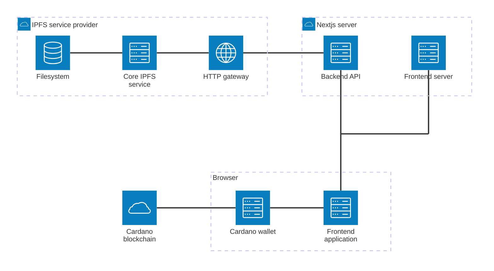
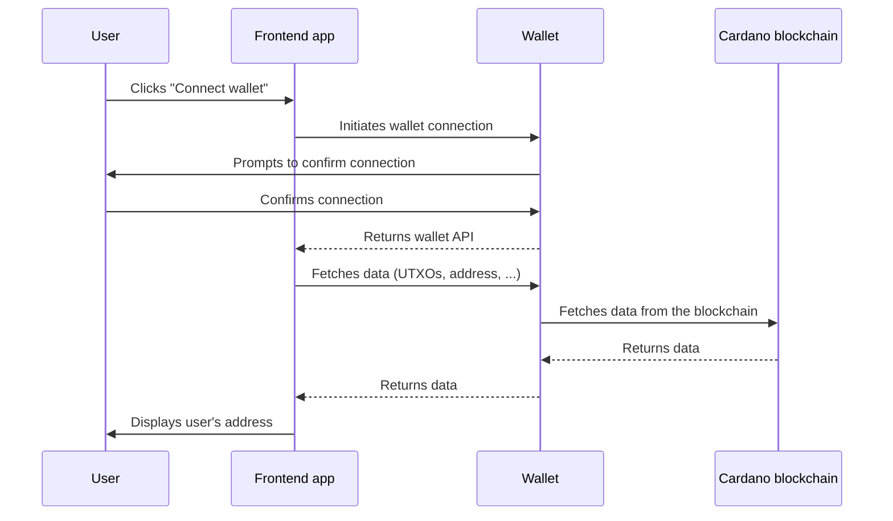
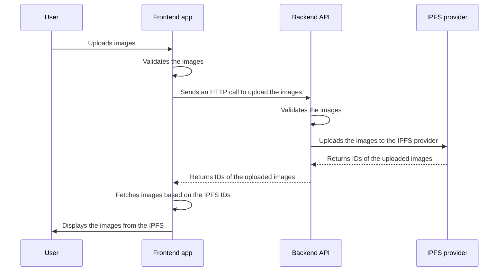
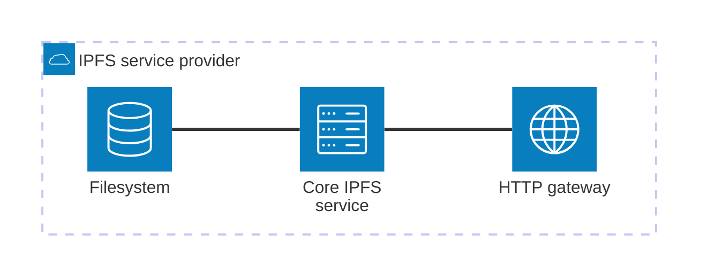

# NFT Forge Architecture

This project is built using [Next.js](https://nextjs.org/), a full-stack React framework. Next.js was selected because it provides an efficient way to develop both frontend and backend functionalities within a single framework. Deploying backend endpoints together with the frontend application on the same server simplifies deployment and reduces infrastructure complexity.

Additionally, Next.js offers several features that streamline frontend development, including its intuitive routing system and support for server-side rendering. The entire codebase is written in TypeScript, ensuring better type safety, improved code maintainability, and a smoother development experience.

## Components

This repository contains a Next.js project that serves as the core of the application, handling both the frontend and backend components in a unified architecture. The structure is designed to maximize efficiency and simplify integration between various parts of the system. The main components of this architecture are:

1. **Next.js server**: server where the Next.js application is running. It includes:

   1. **Backend API**  
      This module is responsible for managing the interactions between the frontend application and external services. It acts as a bridge to communicate with the IPFS server, ensuring smooth data flow and enabling the storage and retrieval of NFT images on the decentralized storage network.

   2. **Frontend server**  
      The frontend server is responsible for serving static assets, such as JavaScript, HTML, and CSS, to the browser-based frontend app. It also performs server-side rendering (SSR) for certain pages to enhance SEO and improve initial page load times. This server ensures the frontend app is delivered efficiently to the user’s browser.

2. **Frontend app**: application that runs in the user's browser.  
   The browser-based frontend app provides users with an intuitive interface for connecting to a Cardano wallet and uploading NFTs images to IPFS. The app communicates directly with the backend API to process user inputs and manage interactions with external services. It also integrates with wallets for retrieving data from the Cardano blockchain.

3. **Cardano wallet**:  
   The wallet is an external component that acts as a gateway between the frontend app and the Cardano blockchain. It allows users to sign transactions, authorize minting actions, and manage their assets securely. The frontend app communicates with the wallet to initiate these operations.

4. **Cardano blockchain**:  
   The Cardano blockchain serves as the decentralized network where NFTs are minted and stored. The blockchain ensures the immutability and security of the minted assets. The wallet interacts with the blockchain to submit signed transactions, verify minting processes, and retrieve blockchain data.

5. **IPFS service provider**  
   This external component is tasked with handling operations related to IPFS (InterPlanetary File System). While it is not included as part of this repository, it plays a critical role in storing and retrieving images for the NFTs. The backend API integrates with this service provider to facilitate these interactions. Detailed information on how the IPFS service provider is configured and used can be found in the [IPFS system design](#ipfs-system-design) section.

By structuring the repository this way, the project ensures a clear separation of concerns and allows for easy scalability and maintainability. While the Next.js server forms the core of the application, the flexibility to integrate with external services like IPFS allows the system to take full advantage of decentralized storage solutions without complicating the core repository.

### Components visualization



## Backend API

The backend API is integrated into the Next.js server and is entirely written in TypeScript. This ensures type safety, better maintainability, and a more reliable development process. The API serves as the backend interface for handling critical operations and is designed to efficiently manage requests between the frontend application and external services. It provides the following REST endpoints, all accessible under the `/api` route:

### `/ipfs/upload`

This endpoint is responsible for uploading the provided file to the IPFS storage system. When a file is uploaded, it is automatically pinned to ensure it remains accessible within the IPFS network. One of the key features of IPFS is its content-addressed storage mechanism, which prevents duplicate data storage. If a file with identical content has already been uploaded to IPFS, the system will not store a duplicate copy. Instead, it will return the `cid` (Content Identifier) of the previously uploaded file. This approach ensures efficient use of storage resources while maintaining seamless accessibility of the file through its unique `cid`.

#### Arguments

The endpoint expects form data that includes a `file` entry containing the image file to be uploaded. Only image files are supported to ensure compatibility with the intended use case. A file is classified as an image if its MIME type starts with `image`, such as `image/png` or `image/jpeg`.

To determine the MIME type of the file, the system checks the file's _magic number_, a sequence of bytes at the beginning of the file that identifies its format. This method ensures that the file's type is accurately detected, even if the file extension has been altered. By relying on the magic number, the endpoint adds an additional layer of validation, ensuring that only legitimate image files are processed and uploaded.

#### Returned data

The response from this endpoint is a JSON object containing essential information about the uploaded file. This object includes the following fields:

- **`name`**: the name of the file that was uploaded. This value reflects the original filename provided in the upload request, allowing users to identify the file easily

- **`size`**: the size of the uploaded file, measured in bytes. This provides a clear indication of the file's storage requirements and ensures transparency about the file's dimensions

- **`cid`**: the Content Identifier (CID) associated with the uploaded file in the IPFS system. This unique identifier is generated based on the file's content using IPFS's content-based addressing. It serves as a permanent reference to the file, enabling retrieval from the IPFS network without relying on traditional location-based storage paths

- **`mimeType`**: the MIME type of the uploaded image

**Example response:**

```json
{
  "name": "image.png",
  "size": 87552,
  "cid": "QmYWkhfnAyZohSV7Nut5cE8nko2RR5X9HD89hBxVqVdtNb"
}
```

#### Errors

- **400: `Invalid form data`**  
  This error indicates that the request's form data is either missing entirely or does not conform to the expected format. Properly structured form data is required to process the upload

- **400: `File not provided`**  
  This error is returned when the form data is present, but the required `file` entry is missing. The `file` entry is mandatory for the upload operation to proceed

- **400: `Invalid file`**  
  This error signifies that the uploaded content is not recognized as a valid file. This may occur if the provided data is corrupted or improperly encoded

- **400: `Invalid file type (only images are supported)`**  
  The provided file does not meet the requirement of being an image. Only files with a MIME type that begins with `image` are allowed. Non-image files will trigger this error

- **500: `Failed to upload file`**  
  This error indicates that the upload process encountered an unexpected server issue. It could result from internal errors, connectivity problems with the IPFS service, or other unforeseen conditions

### `/ipfs/pins`

This endpoint provides a list of `cid`s (Content Identifiers) for all files that are currently pinned in the IPFS storage connected to the Next.js server. Pinning ensures that specific files remain available within the IPFS network by preventing them from being garbage collected. By returning the `cid`s of pinned files, this endpoint allows users or applications to identify and access all files actively maintained in the connected IPFS storage.

#### Arguments

_No arguments._

#### Returned data

The response from this endpoint is a JSON array of IDs representing all pinned files in the IPFS storage.

**Example Response:**

```json
[
  "QmS5cKMjR3kXaTWoJvghPar8sT68kUfChE2dD8JG1QBqN1",
  "QmW3Tpo1i5VPX33o3ShahjDm69VTDdVkJpRACy6orUAfgY",
  "QmYWkhfnAyZohSV7Nut5cE8nko2RR5X9HD89hBxVqVdtNb"
]
```

#### Errors

_No errors._

### Scalability

The scalability of the backend API is closely tied to the configuration and deployment of your infrastructure. To accommodate increased traffic and ensure seamless performance, the Next.js server can be deployed in multiple instances. These instances can be containerized using tools such as Docker, which allows for consistent and portable deployments across various environments.

To efficiently manage these instances and maintain optimal performance, implementing a load balancer is crucial. A load balancer evenly distributes incoming requests across all active server instances, preventing any single instance from becoming a bottleneck. This setup not only enhances the reliability of the system by reducing the risk of downtime due to server overload but also improves the overall user experience by ensuring faster response times during high-traffic periods.

For step-by-step guidance on deploying multiple instances, configuring a load balancer, and optimizing your infrastructure for scalability, consult the official documentation provided by your infrastructure provider. This documentation will typically include best practices for deploying containerized applications, setting up load balancing, and monitoring system performance to ensure smooth operations as your traffic grows.

## Frontend

The frontend application is built using Next.js and TypeScript, ensuring a modern, scalable, and efficient development experience. Running entirely in the user's browser, the app delivers a seamless interface for interacting with the NFT minting platform. It fetches its static assets, including JavaScript, HTML, and CSS files, from the Frontend Server, enabling quick loading and rendering.

The app communicates with the Cardano blockchain indirectly through an integrated Cardano wallet, which acts as a secure intermediary for fetching blockchain data, signing transactions, and submitting them. This architecture ensures a responsive and user-centric experience while leveraging the full potential of decentralized blockchain interactions.

### Core technologies

- [@mui/material](https://mui.com/material-ui/) – used for UI components and theming
- [@tanstack/react-query](https://tanstack.com/query/latest) – simplifies data fetching and mutations using React hooks
- [axios](https://www.axios.com/) – a library for making HTTP requests
- [Mesh](https://meshjs.dev/) - library for wallet communication and transaction building

### Error handling

Different types of errors can occur in the NFT Forge web application:

- **Errors during HTTP calls** – Handled by the `@tanstack/react-query` library and returned in the `useQuery` or `useMutation` hooks. These errors are then displayed in the frontend UI.
- **Errors when communicating with the wallet API** - All calls to the wallet API are wrapped in `try/catch` blocks to ensure that any potential errors are handled correctly. For example, if an error occurs when calling `wallet.getUsedAddresses()`, it will be shown to the user in the frontend UI.
- **Unexpected errors during React rendering** – If an unexpected error occurs while rendering a component, it is caught by the top-level [React error boundary](https://react.dev/reference/react/Component#catching-rendering-errors-with-an-error-boundary). This component displays the error and provides the user with an option to reload the application.

### UI/UX design

The [Frontend UI/UX design](./frontend-design.md) document showcases the UI and UX design of the frontend application in its current state.

### Wallets

In the early stages of development, only a few Cardano wallets will be supported (namely Eternl, Lace, NuFi and Typhon). More wallets will be added in the future.

The minting application connects to these wallets by using the [CIP-30 API](https://cips.cardano.org/cip/CIP-30).

### Blockchain communication

The process of interacting with the Cardano blockchain for NFT minting involves seamless communication between the frontend application, the user's wallet, and the blockchain. The following sequence diagram illustrates the step-by-step flow of connecting wallet to the application.



### API communication

The frontend application communicates with the backend API using the HTTP protocol. The following sequence diagram showcases this communication when user uploads NFTs images to the app.



## IPFS system design

The InterPlanetary File System (IPFS) is utilized as a decentralized storage system for managing NFT images. Unlike traditional databases, IPFS provides a distributed network where files are stored and identified using unique Content Identifiers (CIDs). This approach ensures that NFT images are securely stored and efficiently retrieved, offering a robust and scalable solution for decentralized applications.

If you plan to run your own Next.js server, it is essential to set up your own IPFS service provider to handle the storage and retrieval of files. This service will act as the backend storage layer, integrating with the Next.js server to enable seamless file uploads, pinning, and access to stored content.

To simplify the setup process, you can refer to the [WingRiders IPFS service provider](#wingriders-ipfs-service-provider) as an example. This example provides insights into configuring and deploying an IPFS service provider, including best practices for ensuring reliability, scalability, and integration with your application. By following this example, you can establish a self-sufficient IPFS service that supports your NFT platform.

### Connecting to the IPFS service provider

To establish a connection between your Next.js server and your IPFS service provider, you need to configure the Next.js server with specific environment variables. These variables define the connection details and authentication credentials required to communicate with the IPFS service. Below is a list of the environment variables you need to set up:

- **`IPFS_PROTOCOL`**: specifies the communication protocol used to connect to the IPFS service provider. Common values include `https` for secure connections or `http` for local or non-secure setups

- **`IPFS_HOST`**: the hostname or IP address of the IPFS service provider. For example, `localhost` can be used when running the service locally

- **`IPFS_PORT`**: the port on which the IPFS service is accessible. Ensure this port is open and properly configured in your network settings. For example, `9094`

- **`IPFS_AUTH`**: the credentials required for authenticating with the IPFS service provider. This should be in the format of `username:password`. For example, `user123:securepass`

By setting these variables, the Next.js server can connect to any IPFS service provider that complies with [the standard IPFS cluster API](https://ipfscluster.io/documentation/reference/api/). This ensures compatibility with a wide range of IPFS implementations, allowing you the flexibility to choose or deploy an IPFS service provider that meets your specific requirements.

Make sure to store these credentials securely, such as using environment variable management tools or encrypted secrets storage, to prevent unauthorized access to your IPFS service.

### Authentication

The Next.js server is designed to integrate seamlessly with an IPFS service provider that requires authentication for secure communication. To enable this functionality, you need to configure the `IPFS_AUTH` environment variable on the Next.js server. This variable should contain the authentication credentials for your IPFS gateway, formatted as `username:password`. For example, if the username is `user123` and the password is `securepass`, the variable should be set as `IPFS_AUTH=user123:securepass`.

When the backend API communicates with the IPFS gateway, it automatically includes these credentials to perform basic authentication. This ensures that all requests to the IPFS gateway are authorized and secure, enabling operations such as file uploads, retrieval, and pinning without interruptions.

It is important to store the `IPFS_AUTH` credentials securely to prevent unauthorized access. Consider using environment variable management tools, encrypted secrets storage, or a secure configuration service to safeguard these sensitive details. Properly setting up the authentication not only protects your IPFS resources but also ensures reliable connectivity between the Next.js server and the IPFS gateway.

### Mocked IPFS service provider

If one or more of the `IPFS_*` environment variables are not provided, the Next.js server automatically defaults to using a mocked IPFS service provider. This mock implementation is designed to simulate interactions with a real IPFS service, enabling the server to function without requiring an actual IPFS setup during development or testing.

When files are uploaded using the mocked IPFS service provider, the server responds as if the operation were successful. The response includes all the expected details, such as the accurately calculated `cid` (Content Identifier) for the uploaded file. However, the file itself is not stored anywhere. Instead, only the generated `cid`s of the uploaded files are saved temporarily in memory. These `cid`s can be retrieved through the `/pins` endpoint, allowing you to simulate file management and retrieval without interacting with a real IPFS network.

This approach is particularly useful during the development and testing phases, as it allows for easy running and testing of the Next.js server without needing to configure an actual IPFS service provider. By decoupling the server from external dependencies in this way, developers can focus on building and refining the application logic before integrating with production-ready infrastructure.

# WingRiders IPFS service provider

To facilitate development of this project, a dedicated WingRiders IPFS service provider was set up specifically for the Wingriders instance of the Next.js server. This setup demonstrates how the project can function with a fully operational IPFS service provider in a real-world scenario.

The WingRiders instance of the Next.js server communicates with this IPFS service provider exclusively through a private VPC (Virtual Private Cloud) connection. This private connection ensures that the WingRiders IPFS service provider can only be accessed by the WingRiders instance of the Next.js server. External access to the IPFS service is entirely restricted, making it impossible for other instances or projects to utilize this provider.

It is important to note that the WingRiders IPFS service provider is designed solely for WingRiders’ internal use and is not intended for general-purpose deployment. Projects using this open-source repository must set up and configure their own IPFS service provider to handle storage and retrieval of files. The WingRiders setup serves only as an example of how to setup the IPFS service.

Below is a brief description of the WingRiders IPFS service provider architecture.

## Components

1. **Core IPFS Service**  
   The core IPFS service is the central component responsible for orchestrating the primary IPFS functionality. It handles file storage, retrieval, and the generation of Content Identifiers (CIDs). This service ensures that uploaded files are properly distributed across the IPFS network, providing the foundational infrastructure for decentralized file management.

2. **HTTP Gateway**  
   The HTTP gateway acts as a crucial bridge between the IPFS service and external systems, such as the Next.js backend API. It enables seamless communication by exposing a standard HTTP interface that other systems can interact with. This gateway ensures that requests for uploading, retrieving, and managing files are processed efficiently, serving as the main entry point to the IPFS service for the Next.js application.

3. **Filesystem**  
   The filesystem provides robust and scalable storage for files managed by the IPFS service. This storage is mounted across all availability zones (AZs), ensuring high availability and fault tolerance. Files uploaded to the IPFS service are automatically pinned to maintain accessibility within the network. To safeguard data integrity, the filesystem is regularly backed up and adheres to a retention policy that ensures files are preserved for a sufficiently long duration. This setup guarantees both the reliability of file storage and the long-term accessibility of pinned content.



## Technologies

The WingRiders IPFS service provider is deployed on AWS, leveraging cloud-native technologies to ensure scalability, reliability, and ease of management. It utilizes the following key technologies to implement its IPFS functionality:

- **[ipfs-cluster](https://github.com/ipfs-cluster/ipfs-cluster)**: This serves as the core IPFS service, managing the distribution, pinning, and coordination of files across the cluster. It provides robust features for managing large datasets and ensures that files remain accessible within the IPFS network.

- **[ipfs-kubo](https://github.com/ipfs/kubo)**: This acts as the HTTP gateway, enabling seamless interaction between the IPFS service and external systems, including the Next.js backend API. The gateway provides a standard HTTP interface for uploading, retrieving, and managing files within the IPFS network.

Both of these services are deployed as part of a single **ECS (Elastic Container Service)** service, which simplifies orchestration and management. For redundancy and fault tolerance, the ECS service is configured to run across multiple AWS availability zones (AZs). Each availability zone hosts one instance of the service, ensuring that the IPFS service provider remains highly available even in the event of a failure in a specific zone.

This multi-AZ deployment architecture not only enhances the reliability and uptime of the service but also provides resilience against regional disruptions, making it a robust and scalable solution for managing IPFS-based file storage.

## Scalability

To handle varying levels of demand and ensure optimal performance, a **load balancer** is employed. The load balancer dynamically routes incoming traffic to the appropriate instances of the IPFS gateway, distributing requests evenly across the infrastructure. This mechanism ensures that resources are utilized efficiently and prevents any single instance from becoming overwhelmed during periods of high traffic.

In addition to enhancing scalability, the load balancer contributes to system reliability by detecting unresponsive instances and redirecting traffic to healthy ones. This setup allows the WingRiders Next.js server to maintain consistent performance and high availability, even under fluctuating load conditions or potential infrastructure failures.
