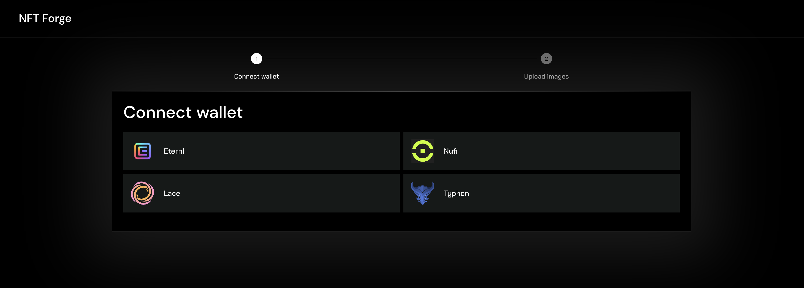
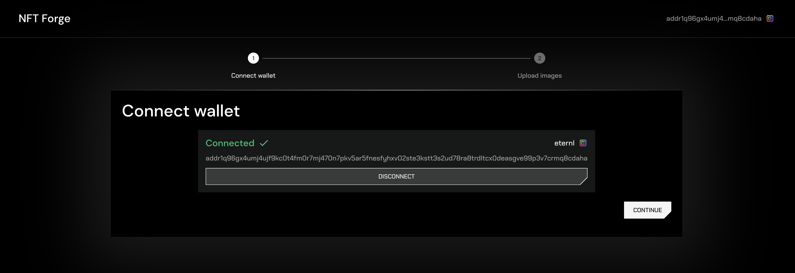
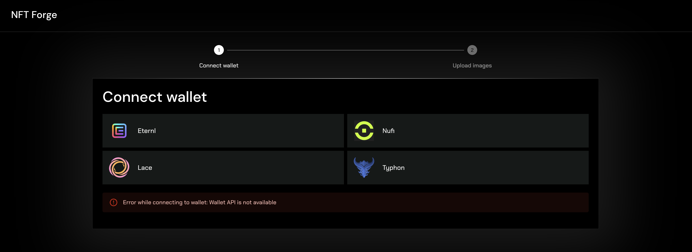
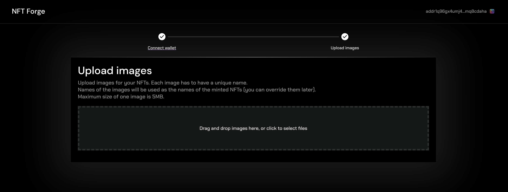
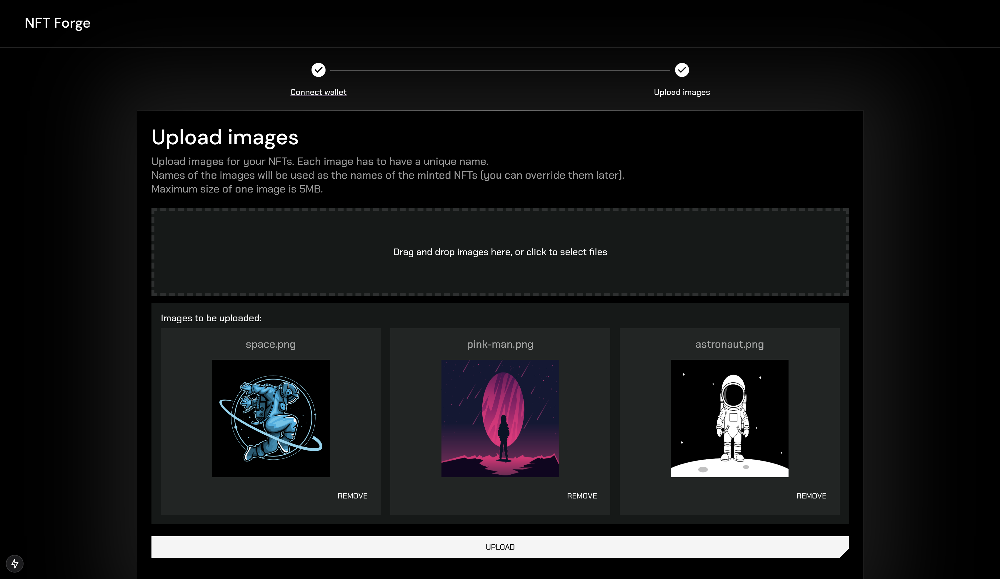
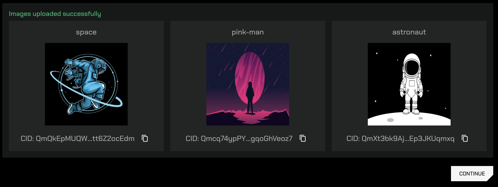
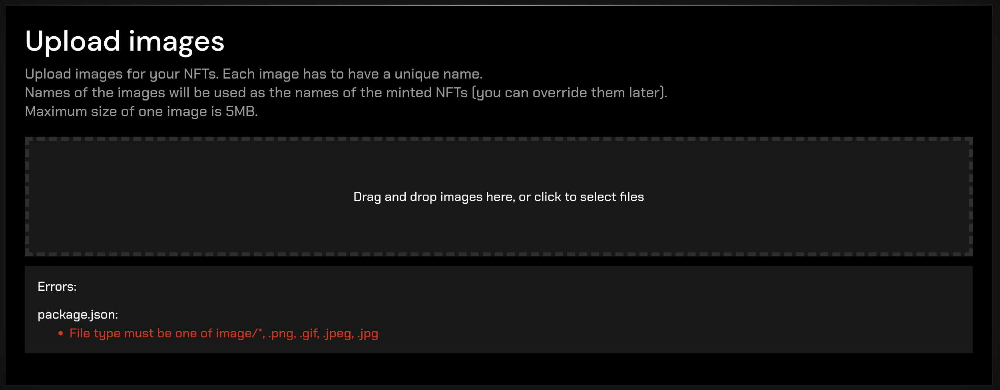
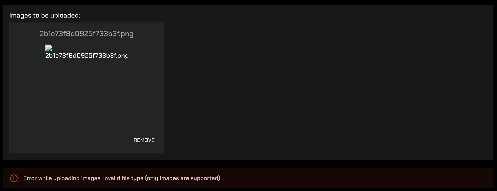

## Frontend UI/UX design

This document presents the design of the NFT Forge web application in it current state.

## Connect wallet

The first screen in the minting process will prompt users to connect their wallet. Currently, users can connected these Cardano wallets:

- Eternl
- NuFi
- Lace
- Typhon

More wallet options will be implemented in the future.

After you successfully connect your wallet, the app will display your address and a `CONTINUE` button:

If there is an error while connecting to the selected wallet, the app will display it:

## Upload NFT images

The next step is to upload images for your NFTs. You can either drag and drop the files into the designated area or click to upload them manually using the file explorer.

The filenames will initially be used as the names of your NFTs, but you can override them later in the process.

After you add your images, the app will display them and you can click the `UPLOAD` button to upload them to the IPFS storage:

After the images are uploaded successfully, the app will display them:

### Error handling

There are multiple different errors that can happen during file upload. The application will handle them and display a meaningful error message to the user.

- Error if the uploaded file is not an image:
  
- Error during backend validation. If the user changes the file extension to e.g. `.png`, but the file is not an image, the backend validation will fail:
  
- Error if the uploaded file is too large:
  
