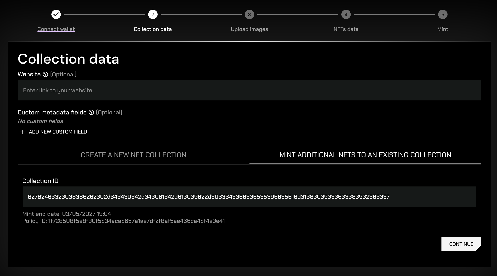
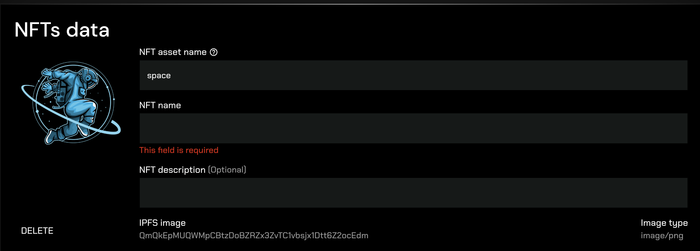

## Frontend UI/UX design

This document presents the design of the NFT Forge web application.

## Connect wallet

The first screen in the minting process will prompt users to connect their wallet. Currently, users can connected these Cardano wallets:

- Eternl
- NuFi
- Lace
- Typhon

More wallet options will be implemented in the future.

After you successfully connect your wallet, the app will display your address, wallet network and collateral status.

If you don't have a collateral set in your wallet, the app will ask you to create it:

If there is an error while connecting to the selected wallet, the app will display it:

## Input collection data

After your wallet is connected successfully, you will be asked to input common data for your collection. You have two options:

1. Create a brand new NFT collection (new policy ID)
2. Mint additional NFTs in your existing collection (you have to be connected with the wallet that created the collection and the minting end date has to be in the future)

Creating a new collection:

Minting additional NFTs in an existing collection:

For each collection, you can define your own custom metadata fields:

## Upload NFT images

The next step is to upload images for your NFTs. You can either drag and drop the files into the designated area or click to upload them manually using the file explorer.

The filenames will initially be used as the names of your NFTs, but you can override them later in the process.

After you add your images, the app will display them and you can click the `UPLOAD` button to upload them to the IPFS storage:

After the images are uploaded successfully, the app will display them together with their IPFS hashes:

### Error handling

There are multiple different errors that can happen during file upload. The application will handle them and display a meaningful error message to the user.

- Error if the uploaded file is not an image:
  
- Error during backend validation. If the user changes the file extension to e.g. `.png`, but the file is not an image, the backend validation will fail:
  
- Error if the uploaded file is too large:
  

## Input NFTs metadata

On the next screen, you will be asked to input metadata for each one of the NFTs. The metadata includes:

- Asset name (identifier on the Cardano blockchain)
- NFT name
- NFT description

### Validation

The app will validate the metadata of your NFTs and display any errors:

- Error if some required metadata field is missing:
  
- Error if multiple NFTs have the same asset name:
  

## Mint

After you input all the data, the last step is to submit the minting transaction. On the last screen in the process, you can review the data of the NFTs and submit the transaction. The app will display the transaction fee for the minting.

When you sign the transaction in your wallet and it gets successfully submitted to the blockchain, the app will display a success modal with this data:

- Link to the minting transaction
- Link to your collection
- ID of your collection

Make sure to save the collection ID, you will need it to mint additional NFTs in this collection.

### Error handling

If there is and error during the transaction building, signing, or submitting, the app will display it:

